# Architecture du projet Blood Cell Analyzer

## Conventions du diagramme

| Forme | Signification |
|---|---|
| `[texte]` rectangle | Service / conteneur Docker |
| `[(texte)]` cylindre | Base de données / stockage persistant |
| `([texte])` stade | Service externe / SaaS cloud |
| `[[texte]]` sous-routine | Script Python / module |
| `[/texte/]` parallélogramme | Données brutes / fichiers |
| `>texte]` asymétrique | Notification / alerte |
| `(texte)` arrondi | Interface utilisateur / onglet |

| Couleur | Catégorie |
|---|---|
| 🟠 Orange | Données brutes |
| 🟢 Vert | Bases de données |
| 🔵 Bleu | Services / API |
| 🟡 Ambre | Orchestration |
| 🔴 Rose | ML / modèle |
| 🩵 Teal | Monitoring |
| 🟣 Violet | Interface utilisateur |
| ⚫ Gris | Infrastructure / tests |
| 🩶 Bleu clair | Services externes SaaS |

---

## Diagramme global

```mermaid
flowchart TD

    %% ─────────────────────────────────────────
    %% DONNÉES BRUTES
    %% ─────────────────────────────────────────
    subgraph DATA["📦 Données"]
        RAW[/"data/raw\nImages JPEG · 8 classes"/]
        LOTSTIFF[/"data/lotstiff\nBatchs TIFF · lots patients"/]
        DAGSHUB(["DagsHub\nDVC remote"])
    end

    %% ─────────────────────────────────────────
    %% PRÉTRAITEMENT
    %% ─────────────────────────────────────────
    subgraph PREP["🐳 Preprocessing · Docker"]
        DVC[["dvc pull\ndagshub remote"]]
        FEAT[["build_features.py\nRedimensionnement · Normalisation"]]
    end

    %% ─────────────────────────────────────────
    %% ENTRAÎNEMENT
    %% ─────────────────────────────────────────
    subgraph TRAIN["🏋️ Entraînement · Docker + GPU distant"]
        AIRFLOW["Airflow\nblood_cell_pipeline\nschedule : dim. 2h"]
        SSH["SSH · Tailscale VPN\nPC Windows GPU"]
        CROSSVAL[["dl_crossval_train.py\nDenseNet-121\nCross-validation 5-fold"]]
        FINETUNE[["incremental_finetune.py\nFine-tuning incrémental"]]
    end

    %% ─────────────────────────────────────────
    %% MLFLOW
    %% ─────────────────────────────────────────
    subgraph MLFLOW_SVC["📊 MLflow · Docker :5001"]
        MLFLOW_DB[("SQLite\nmlflow.db")]
        REGISTRY[("Model Registry\nblood-cell-densenet121\nalias @production")]
        ARTIFACTS[("Artifacts\npoids .pth · métriques")]
    end

    %% ─────────────────────────────────────────
    %% SUPABASE
    %% ─────────────────────────────────────────
    subgraph SUPA["🗄️ Supabase · PostgreSQL cloud"]
        T_USERS[("users\nauthentification")]
        T_PREDS[("predictions\nclasse · confiance\npatient · version")]
        T_FB[("prediction_feedback\nagrees · corrected_class")]
        T_RUNS[("training_runs\nrun_id · génération\nmétriques CPU/GPU")]
        T_DRIFT[("drift_reports\nscores Evidently\nIVDR 2017/746")]
        T_CM[("confusion_matrices\nmatrice par génération")]
        T_PERF[("class_metrics\nF1 · precision · recall\npar classe et génération")]
    end

    %% ─────────────────────────────────────────
    %% API FASTAPI
    %% ─────────────────────────────────────────
    subgraph API["⚡ FastAPI · Docker :8000"]
        AUTH_MW[["Middleware X-API-Key"]]
        GRADCAM[["POST /gradcam\nDenseNet-121 · GradCAM++\nprédiction + heatmap"]]
        FEEDBACK[["POST /feedback\nCorrection médecin"]]
    end

    %% ─────────────────────────────────────────
    %% MONITORING EVIDENTLY
    %% ─────────────────────────────────────────
    subgraph EVID["🔍 Evidently AI · Monitoring"]
        DRIFT_DAG["Airflow\nblood_cell_drift_monitoring\nschedule : quotidien 7h"]
        DRIFT_RPT[["drift_report.py\nDataDriftPreset\nscore de drift"]]
        SHOWCASE[["generate_showcase_report.py\nRapport HTML · 4 métriques"]]
        EMAIL>"email_alert.py\nAlerte IVDR"]
    end

    %% ─────────────────────────────────────────
    %% STREAMLIT
    %% ─────────────────────────────────────────
    subgraph UI["🖥️ Streamlit · Docker :8501"]
        LOGIN("Login\nSupabase auth")
        TAB_CLASS("Classification\nUpload · DagsHub batch\nGrille GradCAM")
        TAB_SEARCH("Recherche\nHistorique prédictions")
        TAB_LOGS("Logs\nRuns MLflow + Supabase")
        TAB_DRIFT("Monitoring\nDrift IVDR · Matrice confusion")
    end

    %% ─────────────────────────────────────────
    %% TESTS
    %% ─────────────────────────────────────────
    subgraph TESTS["🧪 Tests · pytest"]
        UNIT[["tests/1_unit\ntest_dataset · test_transforms"]]
        INTEG[["tests/2_integration\ntest_api · test_predict"]]
    end

    %% ═════════════════════════════════════════
    %% FLUX
    %% ═════════════════════════════════════════

    %% Données → Prétraitement
    DAGSHUB -->|"dvc pull"| DVC
    DVC --> RAW & LOTSTIFF
    RAW --> FEAT

    %% Prétraitement → Entraînement
    FEAT -->|"images préparées"| CROSSVAL & FINETUNE

    %% Orchestration
    AIRFLOW -->|"SSHOperator"| SSH --> CROSSVAL
    AIRFLOW -->|"PythonOperator"| FINETUNE

    %% Entraînement → MLflow
    CROSSVAL -->|"log métriques"| MLFLOW_DB
    CROSSVAL -->|"poids .pth"| ARTIFACTS
    CROSSVAL -->|"promote @production"| REGISTRY
    FINETUNE -->|"log run"| MLFLOW_DB

    %% Entraînement → Supabase
    CROSSVAL -->|"supabase_logger"| T_RUNS
    FINETUNE -->|"supabase_logger"| T_RUNS

    %% MLflow → API
    REGISTRY -->|"charge @production"| GRADCAM

    %% Streamlit → API
    TAB_CLASS -->|"POST /gradcam"| GRADCAM
    TAB_CLASS -->|"POST /feedback"| FEEDBACK
    AUTH_MW -.->|"X-API-Key"| GRADCAM & FEEDBACK

    %% API → Supabase
    GRADCAM -->|"INSERT"| T_PREDS
    FEEDBACK -->|"INSERT"| T_FB

    %% Streamlit → Supabase
    LOGIN -->|"verify_user()"| T_USERS
    TAB_LOGS -->|"fetch_training_runs()"| T_RUNS
    TAB_SEARCH -->|"search_predictions()"| T_PREDS
    TAB_DRIFT -->|"load_last_report()"| T_DRIFT
    TAB_DRIFT -->|"load_confusion_matrix()"| T_CM
    TAB_DRIFT -->|"load_performance_metrics()"| T_PERF

    %% Streamlit → MLflow
    TAB_LOGS -->|"MlflowClient"| MLFLOW_DB

    %% DagsHub batch → Streamlit
    LOTSTIFF -->|"dvc pull batch"| TAB_CLASS

    %% Evidently
    DRIFT_DAG -->|"déclenche"| DRIFT_RPT
    T_PREDS -->|"prédictions courantes"| DRIFT_RPT
    RAW -->|"données de référence"| DRIFT_RPT
    DRIFT_RPT -->|"INSERT"| T_DRIFT & T_CM & T_PERF
    DRIFT_RPT -->|"seuil IVDR dépassé"| EMAIL
    DRIFT_RPT --> SHOWCASE -->|"composant HTML"| TAB_DRIFT

    %% Tests
    UNIT -.->|"pytest"| FEAT
    INTEG -.->|"pytest"| GRADCAM

    %% ═════════════════════════════════════════
    %% STYLES
    %% ═════════════════════════════════════════

    %% 🟠 Orange — données brutes (fichiers)
    classDef rawdata fill:#FFF7ED,stroke:#EA580C,color:#431407

    %% 🩶 Bleu clair — services externes / SaaS
    classDef saas fill:#F0F9FF,stroke:#0284C7,color:#0C4A6E

    %% 🟢 Vert — bases de données / stockage persistant
    classDef db fill:#ECFDF5,stroke:#16A34A,color:#14532D

    %% 🔵 Bleu — services Docker / conteneurs
    classDef service fill:#EFF6FF,stroke:#2563EB,color:#1E3A5F

    %% 🟡 Ambre — orchestration (Airflow, SSH)
    classDef orchestration fill:#FFFBEB,stroke:#D97706,color:#451A03

    %% 🔴 Rose — ML / modèle / scripts d'entraînement
    classDef ml fill:#FFF1F2,stroke:#E11D48,color:#4C0519

    %% 🩵 Teal — monitoring / Evidently
    classDef monitoring fill:#F0FDFA,stroke:#0D9488,color:#134E4A

    %% 🟣 Violet — interface utilisateur / Streamlit
    classDef ui fill:#FAF5FF,stroke:#9333EA,color:#3B0764

    %% ⚫ Gris — infrastructure / tests
    classDef infra fill:#F9FAFB,stroke:#6B7280,color:#111827

    class RAW,LOTSTIFF rawdata
    class DAGSHUB saas
    class MLFLOW_DB,REGISTRY,ARTIFACTS,T_USERS,T_PREDS,T_FB,T_RUNS,T_DRIFT,T_CM,T_PERF db
    class API,MLFLOW_SVC service
    class AIRFLOW,SSH,DRIFT_DAG orchestration
    class DVC,FEAT,CROSSVAL,FINETUNE,GRADCAM,FEEDBACK,AUTH_MW ml
    class DRIFT_RPT,SHOWCASE,EMAIL monitoring
    class LOGIN,TAB_CLASS,TAB_SEARCH,TAB_LOGS,TAB_DRIFT ui
    class UNIT,INTEG infra
```

---

## Description des composants

| Composant | Technologie | Port | Rôle |
|---|---|---|---|
| **Streamlit** | Python / Streamlit | 8501 | Interface utilisateur médicale |
| **FastAPI** | Python / FastAPI + PyTorch | 8000 | Backend ML, inférence DenseNet-121 |
| **MLflow** | MLflow server | 5001 | Suivi des expériences, Model Registry |
| **Supabase** | PostgreSQL managé | 6543 | Stockage prédictions, feedback, runs, drift |
| **DagsHub** | DVC remote | — | Versionning données et modèles |
| **Airflow** | Apache Airflow | 8080 | Orchestration entraînement + monitoring |
| **Evidently** | Evidently AI | — | Rapports de drift (IVDR 2017/746) |

## Flux principaux

1. **Données** : DagsHub → DVC pull → `data/raw` → prétraitement
2. **Entraînement** : Airflow (dim. 2h) → SSH Tailscale → PC Windows GPU → DenseNet-121 5-fold → MLflow Registry `@production`
3. **Inférence** : Streamlit → FastAPI `/gradcam` → DenseNet-121 + GradCAM++ → Supabase `predictions`
4. **Feedback médecin** : Streamlit → FastAPI `/feedback` → Supabase `prediction_feedback`
5. **Monitoring drift** : Airflow (quotidien 7h) → Evidently → Supabase `drift_reports` → alerte email IVDR
6. **Visualisation** : Streamlit onglet Monitoring → Supabase + MLflow → tableaux de bord
